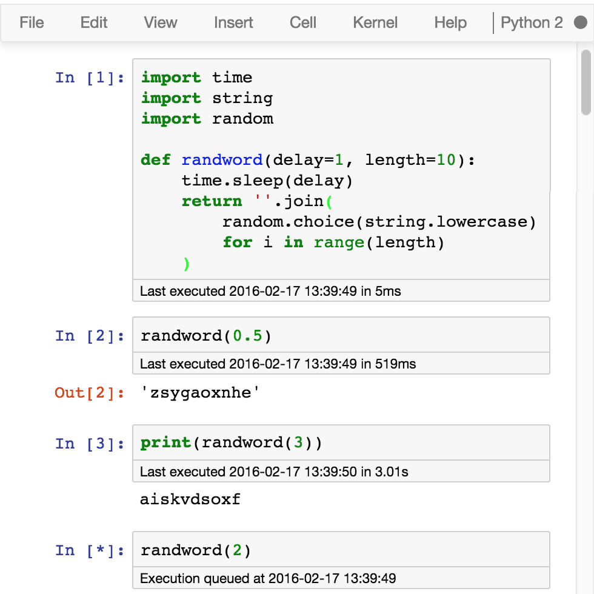
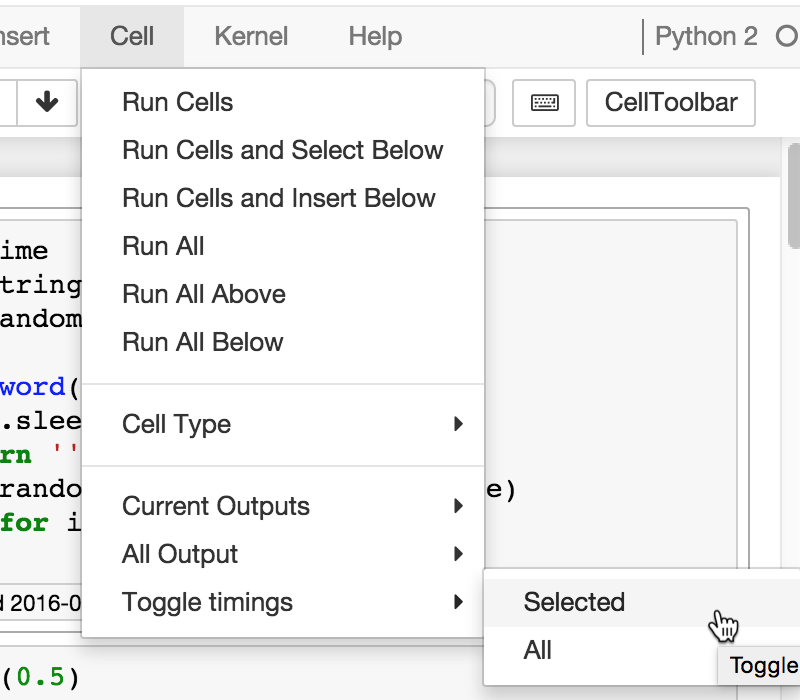

Execute Time
============

This extension displays when the last execution of a code cell occurred, and
how long it took.

Every executed code cell is extended with a new area, attached at the bottom of
the input area, that displays the time at which the user sent the cell to the
kernel for execution.
When the kernel finishes executing the cell, the area is updated with the
duration of the execution.
The timing information is stored in the cell metadata, and restored on notebook
load.




Toggling display
----------------

The timing area can be hidden by double clicking on it, or using the
`Cell -> Toggle timings -> Selected`
menu item.
The menu item
`Cell -> Toggle timings -> All`
hides (shows) all the timing areas in the notebook, if the first cell is
currently shown (hidden).




Options
-------

The nbextension offers a few options for how to display and interpret
timestamps.
Options are stored in the `notebook` section of the server's nbconfig, under
the key `ExecuteTime`.
The easiest way to configure these is using the
[jupyter_nbextensions_configurator](https://github.com/Jupyetr-contrib/jupyter_nbextensions_configurator),
which if you got this nbextension in the usual way from
[jupyter_contrib_nbextensions](https://github.com/ipython-contrib/jupyter_contrib_nbextensions),
should also have been installed.

Alternatively, you can also configure them directly with a few lines of python.
For example, to alter the displayed message, use relative timestamps,
and set them to update every 5 seconds, we can use the following python
snippet:

```python
from notebook.services.config import ConfigManager
ConfigManager().update('notebook', {'ExecuteTime': {
   	'display_absolute_timestamps': False,
    'relative_timing_update_period': 5,
    'template': {
    	'executed': 'started ${start_time}, finished in ${duration}',
    }
}})
```

The available options are:

* `ExecuteTime.display_absolute_timings`: Display absolute timings for the
  start/end time of execution. Setting this `false` will result in the display
  of a relative timestamp like 'a few seconds ago' (see the moment.js function
  [fromNow](https://momentjs.com/docs/#/displaying/fromnow/)
  for details). Defaults to `true`.

* `ExecuteTime.display_absolute_format`: The format to use when displaying
  absolute timings (see `ExecuteTime.display_absolute_timings`, above).
  See the moment.js function
  [format](https://momentjs.com/docs/#/displaying/format/)
  for details of the template tokens available.
  Defaults to `'YYYY-MM-DD HH:mm:ss'`.

* `ExecuteTime.relative_timing_update_period`: Seconds to wait between updating
  the relative timestamps, if using them (see
  `ExecuteTime.display_absolute_timings`, above).
  Defaults to `10`.

* `ExecuteTime.display_in_utc`: Display times in UTC, rather than in the local
  timezone set by the browser.
  Defaults to `false`.

* `ExecuteTime.default_kernel_to_utc`: For kernel timestamps which do not
  specify a timezone, assume UTC.
  Defaults to `true`.

* `ExecuteTime.display_right_aligned`: Right-align the text in the timing area
  under each cell.
  Defaults to `false`.

* `ExecuteTime.highlight.use`: Highlight the displayed execution time on
  completion of execution.
  Defaults to `true`.

* `ExecuteTime.highlight.color`: Color to use for highlighting the displayed
  execution time.
  Defaults to `'#00BB00'`.

* `ExecuteTime.template.executed`: Template for the timing message for executed
  cells. See readme for     replacement tokens.
  Defaults to `'executed in ${duration}, finished ${end_time}'`.

* `ExecuteTime.template.queued`: Template for the timing message for queued
  cells. The template uses an ES2015-like syntax, but replaces only the exact
  strings `${start_time}`, plus (if defined) `${end_time}` and `${duration}`.
  Defaults to `'execution queued ${start_time}'`.


Limitations
-----------


### timezones

As discussed in
[ipython-contrib/jupyter_contrib_nbextensions#549](https://github.com/ipython-contrib/jupyter_contrib_nbextensions/issues/549),
[ipython-contrib/jupyter_contrib_nbextensions#904](https://github.com/ipython-contrib/jupyter_contrib_nbextensions/issues/904),
and
[jupyter/jupyter_client#143](https://github.com/jupyter/jupyter_client/issues/143),
although they are (now) supposed to, Jupyter kernels don't always specify a
timezone for their timestamps, which can cause problems when the
[moment.js](http://momentjs.com/)
library assumes the local timezone, rather than UTC, which is what most kernels
are actually using.
To help to address this, see the [options](#Options) above, which can be used
 to assume UTC for unzoned timestamps.


### execution queues

For a reason I don't understand, when multiple cells are queued for execution,
the kernel doesn't send a reply immediately after finishing executing each
cell.
Some replies are delayed, and sent at the same time as later replies, meaning
that the output of a cell can be updated with its finished value, before the
notebook recieves the kernel execution reply.
For the same reason, you can see this in the fact that the star for an
executing cell can remain next to two cells at once, if several are queued to
execute together.
Since this extension uses the times in the kernel message (see internals,
below), and these remain correct, the timings displayed are still accurate,
but they may get displayed later due to this kernel issue.


Installation
------------

Install the master version of the jupyter_contrib_nbextensions repository as
explained in the docs at
[jupyter-contrib-nbextensions.readthedocs.io](https://jupyter-contrib-nbextensions.readthedocs.io/en/latest/install.html).

Then you can use the
[jupyter_nbextensions_configurator](https://github.com/Jupyter-contrib/jupyter_nbextensions_configurator)
to enable/disable this extension for all notebooks.

Internals
---------

The execution start and end times are stored in the cell metadata as ISO8601
strings, for example:

```json
{
	"ExecuteTime": {
    	"start_time": "2016-02-11T18:51:18.536796",
    	"end_time": "2016-02-11T18:51:35.806119"
	}
}
```

The times in the timing areas are formatted using the
[moment.js](http://momentjs.com/) library (already included as part of
Jupyter), but the durations use a custom formatting function, as
I ([@jcb91](https://github.com/jcb91))
couldn't find an existing one that I liked.

The event `execute.CodeCell` is caught in order to create a start time, and add
the timing area with its 'Execution queued at' message.
The extension again uses [moment.js](http://momentjs.com/) for formatting this
as an ISO string time.

To determine the execution time, the extension patches the Jupyter class
prototype `CodeCell.prototype.get_callbacks` from `notebook/js/codecell.js`.
This patch then patches the `callbacks.shell.reply` function returned by the
original `CodeCell.prototype.get_callbacks`, wrapping it in a function which
reads the `msg.header.date` value from the kernel message, to provide the
execution end time.
This is more accurate than creating a new time, which can be affected by
client-side variability.
In addition, for accurate timings, the start time is also revised using
the `msg.metadata.started` value supplied in the callback, which can be very
different from the time the cell was queued for execution (as a result of
other cells already being executed).
The kernel reply message times are already ISO8601 strings, so no conversion is
necessary, although again, [moment.js](http://momentjs.com/) is used for
parsing and diff'ing them.
